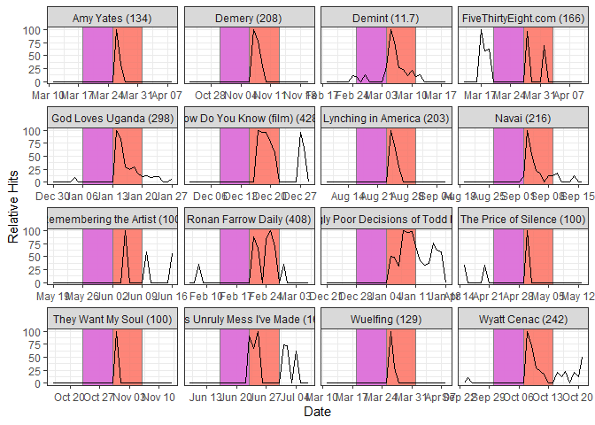
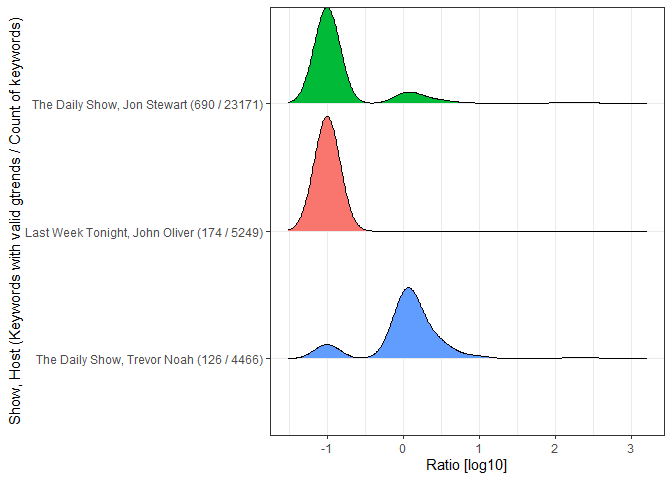

- [Bump](#bump)
  - [Abstract](#abstract)
  - [Gathering the data](#gathering-the-data)
  - [Topic](#topic)
  - [Show-grained visuals](#show-grained-visuals)
  - [Show summaries](#show-summaries)
  - [Limitations](#limitations)
- [Session info](#session-info)

# Bump

## Abstract

Analysis of late night shows looking at the bump in google trends hits
following a show. The Colbert Report discussed the “Colbert-bump”, where
a guest or topic of the show received a boost in attention following the
show. This repository and analysis set out to quantify and summarize the
gain in attention across various late night shows.

``` r
tictoc::tic("Compile report")
suppressPackageStartupMessages({
  library(dplyr)
  library(ggplot2)
  library(ggridges)
})
knitr::opts_chunk$set(warning = FALSE, message = FALSE, cache = FALSE)
```

## Gathering the data

Before we can search the show we need a list of episodes, topics, and
guests to work with. To create such a list I had co-pilot aid me in
creating an `rvest` script to search Wikipedia articles for 4 different
late night shows: The Daily Show (various hosts), Last Week Tonight
(John Oliver), Late Night (Seth Meyers), and The Late Show (Stephen
Colbert). Program information contained topics, guests,
musical/entertainment guests, and occasionally a description.

``` r
load("output/shows2.rda")
shows2 %>% str()
```

    ## tibble [6,838 × 9] (S3: tbl_df/tbl/data.frame)
    ##  $ Show        : chr [1:6838] "Last Week Tonight" "Last Week Tonight" "Last Week Tonight" "Last Week Tonight" ...
    ##  $ Host        : chr [1:6838] "John Oliver" "John Oliver" "John Oliver" "John Oliver" ...
    ##  $ Season      : num [1:6838] 1 1 1 1 1 1 1 1 1 1 ...
    ##  $ Episode     : int [1:6838] 1 2 3 4 5 6 7 8 9 10 ...
    ##  $ Air_Date    : Date[1:6838], format: "2014-04-27" "2014-05-04" ...
    ##  $ Topic       : chr [1:6838] "POM Wonderful LLC v. Coca-Cola Co." "Capital punishment" "Climate change denial" "Right to be forgotten (Google Spain v AEPD and Mario Costeja Gonz\xe1lez)" ...
    ##  $ Guests      : chr [1:6838] NA NA NA NA ...
    ##  $ Music_guests: chr [1:6838] NA NA NA NA ...
    ##  $ Description : chr [1:6838] NA NA NA NA ...

``` r
shows2 %>%
  count(Show, topic = !is.na(Topic)) %>%
  filter(topic == TRUE)
```

    ## # A tibble: 2 × 3
    ##   Show              topic     n
    ##   <chr>             <lgl> <int>
    ## 1 Last Week Tonight TRUE    350
    ## 2 The Daily Show    TRUE   3198

After a variable to compare is selected, `gtrendsR` is used to look up
the relative google hits for each simplified term. A period of 14 days
on either side of the episode air date was retrieved from google trends.
Google trends was available since Jan 1, 2004. I define the following
measure to quantify the gain in search hits around the air date of the
episode.

    ratio = sum of hits in the previous 7 days (minimum of 1) / sum of hits in the proceeding 7 days

## Topic

Let’s consider Topic data for Last Week Tonight and The Daily show.

``` r
load("output/gtrend_topic.rda")
gtrend_topic <- gtrend_topic %>%
  select(-c(Topic, Topic_simplified, Topic_simplified_split))
gtrend_topic %>% str()
```

    ## tibble [36,150 × 13] (S3: tbl_df/tbl/data.frame)
    ##  $ Show    : chr [1:36150] "The Daily Show" "The Daily Show" "The Daily Show" "The Daily Show" ...
    ##  $ Host    : chr [1:36150] "Under various hosts" "Under various hosts" "Under various hosts" "Under various hosts" ...
    ##  $ Season  : num [1:36150] 31 31 31 31 31 31 31 31 31 31 ...
    ##  $ Episode : int [1:36150] 48 47 47 46 45 44 43 42 41 40 ...
    ##  $ Air_Date: Date[1:36150], format: "2025-04-10" "2025-04-09" ...
    ##  $ keyword : chr [1:36150] "The Wedding Banquet" "Neighbors" "Your Friends" "Hate Won't Win" ...
    ##  $ time    : chr [1:36150] "2025-03-27 2025-04-24" "2025-03-26 2025-04-23" "2025-03-26 2025-04-23" "2025-03-25 2025-04-22" ...
    ##  $ error   : chr [1:36150] "Error : Cannot parse the supplied time format.\n" "Error : Cannot parse the supplied time format.\n" "Error : Cannot parse the supplied time format.\n" "Error : Cannot parse the supplied time format.\n" ...
    ##  $ date    : POSIXct[1:36150], format: NA NA ...
    ##  $ hits    : int [1:36150] NA NA NA NA NA NA NA NA NA NA ...
    ##  $ geo     : chr [1:36150] NA NA NA NA ...
    ##  $ gprop   : chr [1:36150] NA NA NA NA ...
    ##  $ category: int [1:36150] NA NA NA NA NA NA NA NA NA NA ...

Not everything returned the expected google trends data. Let’s review
how that broke down.

``` r
## Count Show-episode-search worked
gtrend_topic %>%
  count(Show, Host, Season, Episode, keyword) %>%
  arrange(-n) %>%
  count(Show, Host, worked = n >= 7)
```

    ## # A tibble: 7 × 4
    ##   Show              Host                worked     n
    ##   <chr>             <chr>               <lgl>  <int>
    ## 1 Last Week Tonight John Oliver         FALSE    185
    ## 2 Last Week Tonight John Oliver         TRUE     181
    ## 3 The Daily Show    Jon Stewart         FALSE   1540
    ## 4 The Daily Show    Jon Stewart         TRUE     798
    ## 5 The Daily Show    Trevor Noah         FALSE   1258
    ## 6 The Daily Show    Trevor Noah         TRUE     154
    ## 7 The Daily Show    Under various hosts FALSE    280

``` r
## Topics that Worked
(worked_topic <- gtrend_topic %>%
    count(Show, Season, Episode, keyword) %>%
    filter(n >= 7))
```

    ## # A tibble: 1,133 × 5
    ##    Show              Season Episode keyword                                    n
    ##    <chr>              <dbl>   <int> <chr>                                  <int>
    ##  1 Last Week Tonight      1       2 Capital punishment                        29
    ##  2 Last Week Tonight      1       4 Mario Costeja González)                   29
    ##  3 Last Week Tonight      1       4 Right to be forgotten (Google Spain v…    29
    ##  4 Last Week Tonight      1       5 Net neutrality                            29
    ##  5 Last Week Tonight      1       6 FIFA                                      29
    ##  6 Last Week Tonight      1       9 Burwell v. Hobby Lobby                    29
    ##  7 Last Week Tonight      1      10 Income inequality                         29
    ##  8 Last Week Tonight      1      10 wealth inequality                         29
    ##  9 Last Week Tonight      1      12 Nuclear weapons                           29
    ## 10 Last Week Tonight      1      12 the United States                         29
    ## # ℹ 1,123 more rows

Still, of the remaining data we can apply this analysis.

## Show-grained visuals

This illustrates the ratio timeframe, one week beforehand is shaded in
orcid purple, while a one week after is shaded in salmon red. The ratio
is the after over before (with a minimum of 1). The ratio of the
different topics are displayed in parentheses.

``` r
gdat <- worked_topic %>%
  ## Filter data to those that worked
  inner_join(gtrend_topic, .) %>%
  ## Create measures
  mutate(days_relative_to_Air_Date = (as.Date(date) - Air_Date) %>% as.numeric()) %>%
  group_by(Show, Host, Season, Episode, Air_Date, keyword) %>%
  summarize(
    sum_hits_before = max(sum(hits[days_relative_to_Air_Date < 0 & days_relative_to_Air_Date >= -7], na.rm = TRUE), 1),
    sum_hits_after = sum(hits[days_relative_to_Air_Date > 0 & days_relative_to_Air_Date <= 7], na.rm = TRUE),
    ratio = sum_hits_after / sum_hits_before
  ) %>%
  ungroup() %>%
  ## Join back to data.
  inner_join(., gtrend_topic %>%
               select(Show, Host, Season, Episode,
                      Air_Date, keyword, date, hits)) %>%
  mutate(keyword2 = paste0(keyword, " (", (ratio %>% round(2)), ")"),
         start_purple = Air_Date - 7,
         end_purple = Air_Date,
         start_red = Air_Date,
         end_red = Air_Date + 7
  ) %>%
  arrange(-ratio)

## Plot
gdat %>%
  head(16 * 29) %>%
  filter(!is.na(date), !is.na(keyword2)) %>%
  mutate(date = as.Date(date)) %>%
  ggplot(aes(date, hits, group = keyword2)) +
  geom_rect(
    aes(xmin = start_purple, xmax = end_purple, ymin = -Inf, ymax = Inf),
    fill = "orchid", color = "grey50", alpha = 0.1, inherit.aes = FALSE) +
  geom_rect(
    aes(xmin = start_red, xmax = end_red, ymin = -Inf, ymax = Inf),
    fill = "salmon", color = "grey50", alpha = 0.1, inherit.aes = FALSE) +
  geom_line() +
  facet_wrap(~keyword2, scales = "free_x") +
  labs(x = "Date", y = "Relative Hits") +
  theme_bw()
```

<!-- -->

## Show summaries

Summary of show:

``` r
## Summary of show
gdat %>%
  group_by(Show, Host) %>%
  summarize(mean_ratio = mean(ratio, na.rm = TRUE),
            median_ratio = median(ratio, na.rm = TRUE),
            sd_ratio = sd(ratio, na.rm = TRUE),
            mean_keywords_per_episode = mean((n() / 29) %>% ceiling(), na.rm = TRUE) / n_distinct(Episode)) %>%
  left_join(., gtrend_topic %>%
              group_by(Show, Host) %>%
              summarize(pct_error = 100 * sum(substring(error, 1, 5) == "Error", na.rm = TRUE) / n())
  )
```

    ## # A tibble: 3 × 7
    ## # Groups:   Show [2]
    ##   Show   Host  mean_ratio median_ratio sd_ratio mean_keywords_per_ep…¹ pct_error
    ##   <chr>  <chr>      <dbl>        <dbl>    <dbl>                  <dbl>     <dbl>
    ## 1 Last … John…       0            0         0                     1.06      3.40
    ## 2 The D… Jon …       3.39         0        29.0                   4.90      6.23
    ## 3 The D… Trev…       7.03         1.04     44.8                   1.47     22.0 
    ## # ℹ abbreviated name: ¹​mean_keywords_per_episode

Visual of ratio, log10

``` r
gdat %>%
  #filter(ratio > 1) %>%
  count(Show, Host, keyword, ratio) %>%
  inner_join(., gdat %>% count(Show, Host) %>% rename(n_keywords = n)) %>%
  inner_join(., gdat %>%
               count(Show, Host, keyword) %>%
               mutate(n_worked = n > 7) %>%
               count(Show, Host, n_worked) %>%
               select(-n_worked) %>%
               rename(n_worked = n)) %>%
  mutate(Show_Host = paste0(Show, ", ", Host, " (",n_worked, " / ", n_keywords, ")")) %>%
  ggplot(aes(x = log10(ratio + .1),
             y = reorder(Show_Host, n_keywords), fill = Show_Host)) +
  geom_density_ridges(scale = .9) + # Adjust the scale to reduce overlap
  theme_bw() +
  theme(legend.position = "none") +
  labs(x = "Ratio [log10]",
       y = "Show, Host (Keywords with valid gtrends / Count of keywords)")
```

<!-- -->

Highest ratios:

``` r
## Keyword by descending ratio
gdat %>%
  filter(ratio != Inf) %>%
  count(Show, Host, Season, Episode, keyword, ratio) %>%
  arrange(-ratio) %>%
  select(-n)
```

    ## # A tibble: 1,133 × 6
    ##    Show           Host        Season Episode keyword                       ratio
    ##    <chr>          <chr>        <dbl>   <int> <chr>                         <dbl>
    ##  1 The Daily Show Trevor Noah     22       1 The Increasingly Poor Decisi…   497
    ##  2 The Daily Show Jon Stewart     15     160 How Do You Know (film)          428
    ##  3 The Daily Show Jon Stewart     19      26 Ronan Farrow Daily              408
    ##  4 The Daily Show Jon Stewart     19       5 God Loves Uganda                298
    ##  5 The Daily Show Jon Stewart     19     125 Wyatt Cenac                     242
    ##  6 The Daily Show Jon Stewart     19     106 Navai                           216
    ##  7 The Daily Show Jon Stewart     18     139 Demery                          208
    ##  8 The Daily Show Trevor Noah     23     105 Lynching in America             203
    ##  9 The Daily Show Trevor Noah     22      84 This Unruly Mess I've Made      168
    ## 10 The Daily Show Jon Stewart     19      42 FiveThirtyEight.com             166
    ## # ℹ 1,123 more rows

Lowest ratios:

``` r
## Keyword by ascending ratio
gdat %>%
  filter(ratio != Inf) %>%
  count(Show, Host, Season, Episode, keyword, ratio) %>%
  arrange(ratio) %>%
  select(-n)
```

    ## # A tibble: 1,133 × 6
    ##    Show              Host        Season Episode keyword                    ratio
    ##    <chr>             <chr>        <dbl>   <int> <chr>                      <dbl>
    ##  1 Last Week Tonight John Oliver      1       2 Capital punishment             0
    ##  2 Last Week Tonight John Oliver      1       4 Mario Costeja González)        0
    ##  3 Last Week Tonight John Oliver      1       4 Right to be forgotten (Go…     0
    ##  4 Last Week Tonight John Oliver      1       5 Net neutrality                 0
    ##  5 Last Week Tonight John Oliver      1       6 FIFA                           0
    ##  6 Last Week Tonight John Oliver      1       9 Burwell v. Hobby Lobby         0
    ##  7 Last Week Tonight John Oliver      1      10 Income inequality              0
    ##  8 Last Week Tonight John Oliver      1      10 wealth inequality              0
    ##  9 Last Week Tonight John Oliver      1      12 Nuclear weapons                0
    ## 10 Last Week Tonight John Oliver      1      12 the United States              0
    ## # ℹ 1,123 more rows

## Limitations

Google trends only go back to 2004/1/1. Google trends had surprisingly
low throughput of returning results even when querying spanned several
days to avoid API limits. Some trend response seem unrealistically low,
for instance all of John Oliver’s last week tonight that worked gave
ratios of 0 or 1, but never above that.

# Session info

``` r
tictoc::toc() ## "Compile report"
```

    ## Compile report: 4.91 sec elapsed

``` r
sessionInfo()
```

    ## R version 4.4.3 (2025-02-28 ucrt)
    ## Platform: x86_64-w64-mingw32/x64
    ## Running under: Windows 10 x64 (build 19045)
    ## 
    ## Matrix products: default
    ## 
    ## 
    ## locale:
    ## [1] LC_COLLATE=English_United States.utf8 
    ## [2] LC_CTYPE=English_United States.utf8   
    ## [3] LC_MONETARY=English_United States.utf8
    ## [4] LC_NUMERIC=C                          
    ## [5] LC_TIME=English_United States.utf8    
    ## 
    ## time zone: America/Chicago
    ## tzcode source: internal
    ## 
    ## attached base packages:
    ## [1] stats     graphics  grDevices utils     datasets  methods   base     
    ## 
    ## other attached packages:
    ## [1] ggridges_0.5.6 ggplot2_3.5.1  dplyr_1.1.4   
    ## 
    ## loaded via a namespace (and not attached):
    ##  [1] vctrs_0.6.5       cli_3.6.4         knitr_1.49        rlang_1.1.5      
    ##  [5] xfun_0.51         generics_0.1.3    labeling_0.4.3    glue_1.8.0       
    ##  [9] colorspace_2.1-1  htmltools_0.5.8.1 scales_1.3.0      rmarkdown_2.29   
    ## [13] grid_4.4.3        evaluate_1.0.3    munsell_0.5.1     tibble_3.2.1     
    ## [17] fastmap_1.2.0     yaml_2.3.10       lifecycle_1.0.4   compiler_4.4.3   
    ## [21] pkgconfig_2.0.3   rstudioapi_0.17.1 farver_2.1.2      digest_0.6.37    
    ## [25] R6_2.6.1          utf8_1.2.4        tidyselect_1.2.1  pillar_1.10.1    
    ## [29] magrittr_2.0.3    withr_3.0.2       tools_4.4.3       gtable_0.3.6     
    ## [33] tictoc_1.2.1
